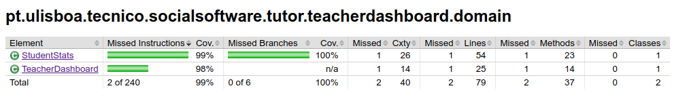
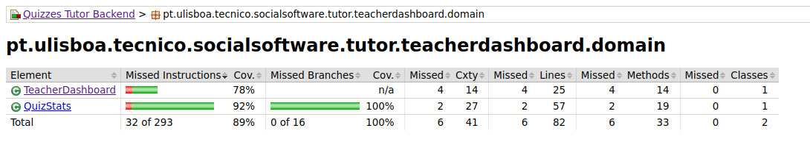
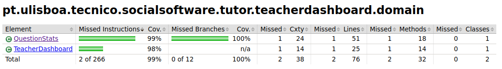

# ES P1 submission, Group NN

## Feature ESA

### Subgroup
 - Manuel Pereira, 98580, [GitLab link](https://gitlab.rnl.tecnico.ulisboa.pt/ist198580)
   + Issues assigned: [#15](https://gitlab.rnl.tecnico.ulisboa.pt/es/es23-46/-/issues/15), [#18](https://gitlab.rnl.tecnico.ulisboa.pt/es/es23-46/-/issues/18), [#19](https://gitlab.rnl.tecnico.ulisboa.pt/es/es23-46/-/issues/19), [#21](https://gitlab.rnl.tecnico.ulisboa.pt/es/es23-46/-/issues/21), [#22](https://gitlab.rnl.tecnico.ulisboa.pt/es/es23-46/-/issues/22), [#23](https://gitlab.rnl.tecnico.ulisboa.pt/es/es23-46/-/issues/23), [#24](https://gitlab.rnl.tecnico.ulisboa.pt/es/es23-46/-/issues/24)
 - Ana Baptista, 95529, [GitLab link](https://gitlab.rnl.tecnico.ulisboa.pt/ist195529)
   + Issues assigned: [#14](https://gitlab.rnl.tecnico.ulisboa.pt/es/es23-46/-/issues/14), [#16](https://gitlab.rnl.tecnico.ulisboa.pt/es/es23-46/-/issues/16), [#20](https://gitlab.rnl.tecnico.ulisboa.pt/es/es23-46/-/issues/20), [#25](https://gitlab.rnl.tecnico.ulisboa.pt/es/es23-46/-/issues/25)
 
### Merge requests associated with this feature

The list of pull requests associated with this feature is:

 - [MR #1](https://gitlab.rnl.tecnico.ulisboa.pt/es/es23-46/-/merge_requests/1)
 - [MR #2](https://gitlab.rnl.tecnico.ulisboa.pt/es/es23-46/-/merge_requests/2)
 - [MR #3](https://gitlab.rnl.tecnico.ulisboa.pt/es/es23-46/-/merge_requests/3)
 - [MR #4](https://gitlab.rnl.tecnico.ulisboa.pt/es/es23-46/-/merge_requests/4)

### Test Coverage Screenshot

The screenshot includes the test coverage results associated with the new/changed entities:

---

## Feature ESQ

### Subgroup
 - Tiago Quinteiro, 199336, [GitLab link](https://gitlab.rnl.tecnico.ulisboa.pt/ist199336)
   + Issues assigned: [#10](https://gitlab.rnl.tecnico.ulisboa.pt/es/es23-46/-/issues/10) [#11](https://gitlab.rnl.tecnico.ulisboa.pt/es/es23-46/-/issues/11) [#12](https://gitlab.rnl.tecnico.ulisboa.pt/es/es23-46/-/issues/12) [#17](https://gitlab.rnl.tecnico.ulisboa.pt/es/es23-46/-/issues/17) [#28](https://gitlab.rnl.tecnico.ulisboa.pt/es/es23-46/-/issues/28) [#34](https://gitlab.rnl.tecnico.ulisboa.pt/es/es23-46/-/issues/34) [#38](https://gitlab.rnl.tecnico.ulisboa.pt/es/es23-46/-/issues/38)
 - Gonçalo Correia, 425200, [GitLab link](https://gitlab.rnl.tecnico.ulisboa.pt/ist425200)
   + Issues assigned: [#13](https://gitlab.rnl.tecnico.ulisboa.pt/es/es23-46/-/issues/13) [#27](https://gitlab.rnl.tecnico.ulisboa.pt/es/es23-46/-/issues/27) [#32](https://gitlab.rnl.tecnico.ulisboa.pt/es/es23-46/-/issues/32) [#33](https://gitlab.rnl.tecnico.ulisboa.pt/es/es23-46/-/issues/33)
 
### Merge requests associated with this feature

The list of pull requests associated with this feature is:

 - [MR #1](https://gitlab.rnl.tecnico.ulisboa.pt/es/es23-46/-/merge_requests/5)

### Test Coverage Screenshot

The screenshot includes the test coverage results associated with the new/changed entities:

---

## Feature ESP

### Subgroup
 - João Almeida, 89481, [GitLab link](https://gitlab.rnl.tecnico.ulisboa.pt/ist189481)
   + Issues assigned: [#30](https://gitlab.rnl.tecnico.ulisboa.pt/es/es23-46/-/issues/30), [#31](https://gitlab.rnl.tecnico.ulisboa.pt/es/es23-46/-/issues/31), [#36](https://gitlab.rnl.tecnico.ulisboa.pt/es/es23-46/-/issues/36), [#39](https://gitlab.rnl.tecnico.ulisboa.pt/es/es23-46/-/issues/39)

 - Tiago Dias, 99337, [GitLab link](https://gitlab.rnl.tecnico.ulisboa.pt/ist199337)
   + Issues assigned: [#29](https://gitlab.rnl.tecnico.ulisboa.pt/es/es23-46/-/issues/29), [#35](https://gitlab.rnl.tecnico.ulisboa.pt/es/es23-46/-/issues/35), [#37](https://gitlab.rnl.tecnico.ulisboa.pt/es/es23-46/-/issues/37), [#41](https://gitlab.rnl.tecnico.ulisboa.pt/es/es23-46/-/issues/41)
 
### Merge requests associated with this feature

The list of pull requests associated with this feature is:

 - [MR #1](https://gitlab.rnl.tecnico.ulisboa.pt/es/es23-46/-/merge_requests/6)

### Test Coverage Screenshot

The screenshot includes the test coverage results associated with the new/changed entities:

---
