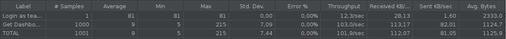
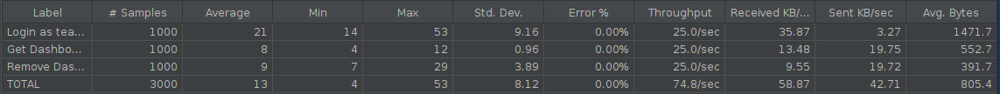

# ES P3 submission, Group 46

## Did your group use the base code provided?

Yes

## Feature ESA

### Subgroup
- Manuel Pereira, 98580, [GitLab link](https://gitlab.rnl.tecnico.ulisboa.pt/ist198580)
    + Issues assigned: [#82](https://gitlab.rnl.tecnico.ulisboa.pt/es/es23-46/-/issues/82), [#84](https://gitlab.rnl.tecnico.ulisboa.pt/es/es23-46/-/issues/84), [#87](https://gitlab.rnl.tecnico.ulisboa.pt/es/es23-46/-/issues/87)
- Ana Baptista, 95529, [GitLab link](https://gitlab.rnl.tecnico.ulisboa.pt/ist195529)
    + Issues assigned: [#83](https://gitlab.rnl.tecnico.ulisboa.pt/es/es23-46/-/issues/83), [#85](https://gitlab.rnl.tecnico.ulisboa.pt/es/es23-46/-/issues/85), [#86](https://gitlab.rnl.tecnico.ulisboa.pt/es/es23-46/-/issues/86)
 
### Merge requests associated with this feature

The list of pull requests associated with this feature is:

 - [MR #1](https://gitlab.rnl.tecnico.ulisboa.pt/es/es23-46/-/merge_requests/14)

### JMeter Load test

  - JMeter test: get
  

### Cypress end-to-end tests

- Data initialization: explain how and where you have initialized the data for your tests.

To initialize the data for our cypress testes we used the files commands.js and database.js. In the file, database.js,  
that manipulates the database directly, we created methods that would do exactly that, add instances to the database,   
particularly teacherDashboards and Student, Quiz and Question Stats. Then, in the file commands.js we created a command  
to populate the database, that uses various methods from database.js to be used in the cypress tests.
- [Link to initialization] (https://gitlab.rnl.tecnico.ulisboa.pt/es/es23-46/-/blob/master/frontend/tests/e2e/support/commands.js#L562)

- [Cypress test 1] (https://gitlab.rnl.tecnico.ulisboa.pt/es/es23-46/-/blob/master/frontend/tests/e2e/specs/teacher/teacherDashboard.js#L23)

---

## Feature ESQ

### Subgroup
- Tiago Quinteiro, 99336, [GitLab link](https://gitlab.rnl.tecnico.ulisboa.pt/ist199336)
    + Issues assigned: [#90](https://gitlab.rnl.tecnico.ulisboa.pt/es/es23-46/-/issues/90), [#97](https://gitlab.rnl.tecnico.ulisboa.pt/es/es23-46/-/issues/97), [#98](https://gitlab.rnl.tecnico.ulisboa.pt/es/es23-46/-/issues/98)
- Gonçalo Correia, 425200, [GitLab link](https://gitlab.rnl.tecnico.ulisboa.pt/ist425200)
    + Issues assigned: [#94](https://gitlab.rnl.tecnico.ulisboa.pt/es/es23-46/-/issues/94), [#99](https://gitlab.rnl.tecnico.ulisboa.pt/es/es23-46/-/issues/99), [#100](https://gitlab.rnl.tecnico.ulisboa.pt/es/es23-46/-/issues/100)
 
### Merge requests associated with this feature

The list of pull requests associated with this feature is:

 - [MR #1] (https://gitlab.rnl.tecnico.ulisboa.pt/es/es23-46/-/merge_requests/15)

### JMeter Load test

  - JMeter test: update

### Cypress end-to-end tests

- Data initialization: to explain how and where you have initialized the data for your tests.

To initialize the data for our cypress testes we used the files commands.js and database.js. In the file, database.js,  
that manipulates the database directly, we created methods that would do exactly that, add instances to the database,   
particularly teacherDashboards and Student, Quiz and Question Stats. Then, in the file commands.js we created a command  
to populate the database, that uses various methods from database.js to be used in the cypress tests.  
- [Link to initialization] (https://gitlab.rnl.tecnico.ulisboa.pt/es/es23-46/-/blob/master/frontend/tests/e2e/support/commands.js#L562)

- [Cypress test 2] (https://gitlab.rnl.tecnico.ulisboa.pt/es/es23-46/-/blob/master/frontend/tests/e2e/specs/teacher/teacherDashboard.js#L68)

---

## Feature ESP

### Subgroup
- João Almeida, 89481, [GitLab link](https://gitlab.rnl.tecnico.ulisboa.pt/ist189481)
    + Issues assigned: [#92](https://gitlab.rnl.tecnico.ulisboa.pt/es/es23-46/-/issues/92), [#93](https://gitlab.rnl.tecnico.ulisboa.pt/es/es23-46/-/issues/93), [#102](https://gitlab.rnl.tecnico.ulisboa.pt/es/es23-46/-/issues/102), [#103](https://gitlab.rnl.tecnico.ulisboa.pt/es/es23-46/-/issues/103)

- Tiago Dias, 99337, [GitLab link](https://gitlab.rnl.tecnico.ulisboa.pt/ist199337)
    + Issues assigned: [#104](https://gitlab.rnl.tecnico.ulisboa.pt/es/es23-46/-/issues/104)

### Merge requests associated with this feature

The list of pull requests associated with this feature is:

 - [MR #1](https://gitlab.rnl.tecnico.ulisboa.pt/es/es23-46/-/merge_requests/16)

### JMeter Load test

  - JMeter test: create → remove
  

### Cypress end-to-end tests

- Data initialization: explain how and where you have initialized the data for your tests.

To initialize the data for our cypress testes we used the files commands.js and database.js. In the file, database.js,  
that manipulates the database directly, we created methods that would do exactly that, add instances to the database,   
particularly teacherDashboards and Student, Quiz and Question Stats. Then, in the file commands.js we created a command  
to populate the database, that uses various methods from database.js to be used in the cypress tests.
- [Link to initialization] (https://gitlab.rnl.tecnico.ulisboa.pt/es/es23-46/-/blob/master/frontend/tests/e2e/support/commands.js#L562)  

- [Cypress test 3] (https://gitlab.rnl.tecnico.ulisboa.pt/es/es23-46/-/blob/master/frontend/tests/e2e/specs/teacher/teacherDashboard.js#L112)

---

### Merge requests associated with the feature ALL

The list of pull requests associated with this feature is:

- [MR #1](https://gitlab.rnl.tecnico.ulisboa.pt/es/es23-46/-/merge_requests/17)
- [MR #2](https://gitlab.rnl.tecnico.ulisboa.pt/es/es23-46/-/merge_requests/18)